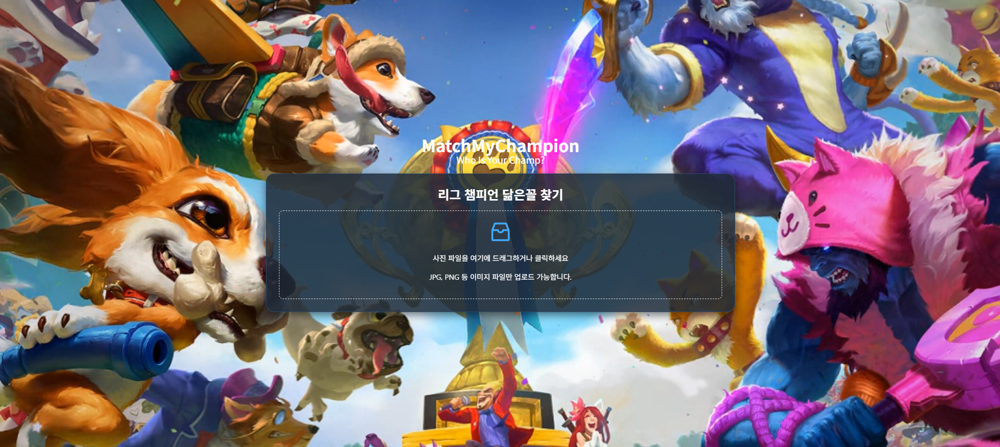
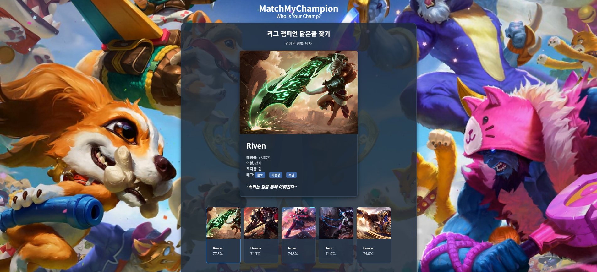

🎮 LOL 챔피언 얼굴 매칭 시스템
리그 오브 레전드(LOL) 챔피언 중 나와 가장 닮은 챔피언을 AI가 자동으로 찾아주는 웹서비스입니다.

✨ 프로젝트 소개
이 프로젝트는 사용자가 본인의 사진을 업로드하면 얼굴 특징을 분석하여,
가장 닮은 LOL 챔피언을 추천해주는 웹 어플리케이션입니다.
주요 기술 스택: React, Ant Design, FastAPI, Python(face_recognition)

🔍 주요 기능
이미지 업로드 및 분석: 사용자가 얼굴 사진을 업로드하면 서버에서 실시간 분석
닮은 챔피언 추천: 가장 닮은 챔피언 이미지, 이름, 매칭률을 즉시 화면에 표시
쉽고 빠른 재테스트: "다시 테스트하기" 버튼 클릭 한 번으로 재업로드 가능

📸 최종 결과물 화면

### 이미지 업로드 전 화면

### 매칭 결과 화면

🛠 사용된 기술
프론트엔드
React (Vite로 초기화)
Ant Design (컴포넌트 라이브러리)

백엔드
Python 3.10
FastAPI, Uvicorn
face_recognition (얼굴 인식)

기타 도구
Git, GitHub (버전 관리)

⚙ 설치 및 실행 방법
📍 백엔드 서버 실행 (FastAPI)
# 가상환경 활성화
.\venv310\Scripts\activate
# 필요 패키지 설치
pip install fastapi uvicorn python-multipart face_recognition
# 서버 실행
uvicorn main:app --reload

📍 프론트엔드 실행 (React)
# 필요한 라이브러리 설치
npm install
# React 앱 실행
npm run dev

✅ 프로젝트 진행 과정
프로젝트 환경 설정 및 구조 정의
서버: 이미지 업로드, 얼굴 인식 및 닮은 챔피언 매칭 기능 개발
프론트엔드: 이미지 업로드 기능 및 서버와 결과 연동
웹사이트 UI 디자인 및 조건부 렌더링 구현
GitHub 연동 및 프로젝트 버전 관리

🐞 해결한 주요 이슈들
Python 가상환경 패키지 충돌 문제
CORS 문제 (FastAPI ↔ React 연동)
일부 챔피언 이미지 인식 실패 (이미지 교체 해결)
GitHub safe.directory 문제 (git config 설정)

✨ 향후 추가 예정 기능
더 다양한 챔피언 데이터 확보하여 정확도 향상
결과 히스토리 기능
모바일 최적화 (반응형 UI 구현)

## License
This project is licensed under the MIT License.
